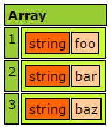

# Arrays Examples

Lucee Array indexes start at 1

##Creating Arrays

Arrays can be created with elements or empty and elements added later.

###Create an Array with some elements


###Create an Empty Array



###Appending Elements to an Array



##Referencing Arrays



###Dyanmic References
Dynamic variables work as expected



##Dumping Arrays



Will look like: 

##Looping Arrays

###For Loop



###For In Loop



###Loop Tag



###Loop Tag with with Index



###Each



##Advanced Array Usage

Arrays have many functions, see all uses here: http://luceedocs.herokuapp.com/objects

>Note: The member functions available on the Array object like .sort() duplicate the older "Built in Function" (BIF) style (like arraySort()). Modern convention is to use the new style, but the old BIFs are still provided for compatibility with older version of Lucee.

