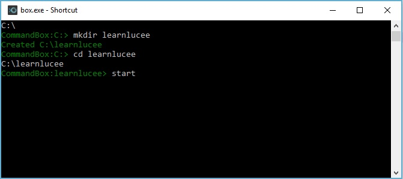
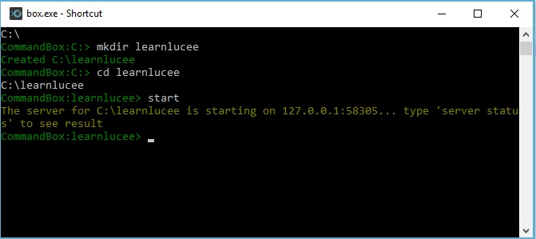
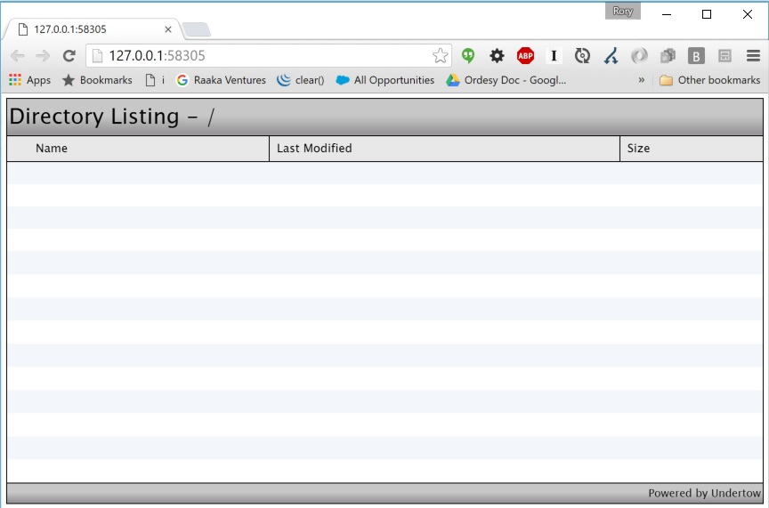

# Lucee Server

Lucee is a Java based application server and is deployed to Java Servlet containers like Tomcat. Lucee can be run behind a Web Server like Apache or Nginx to provide additional capabilities of those servers like mod_rewrite, caching and serving static files.

##Running Lucee for Development Quick Start
The easiest way to begin running Lucee is to utilize the [CommandBox](https://www.ortussolutions.com/products/commandbox) command line tool which will allow you to start and stop Lucee servers for development, and try out the Lucee language. 

Read the [CommandBox documentation](http://commandbox.ortusbooks.com/content/) for full capabilities on running a [server](https://ortus.gitbooks.io/commandbox-documentation/content/embedded_server/embedded_server.html)

###Step 1
Download [CommandBox](https://www.ortussolutions.com/products/commandbox) for your OS and follow the installation instructions.

###Step 2
Path to any directory in command box and type start. CommandBox will start a Lucee server in this directory and open your web browser and show you a file directory. If you place any .cfm files in this directory you will be able to execute them. 

The above image shows three commands being executed: 

> mkdir learnlucee 

This create a directory to store my files for development. You can create as many directories as you need anywhere.

> cd learnlucee

This "change directory" (cd) command put me into the learnlucee folder

> start

This started up Lucee on a random port (it picks one that is available but you can manually set this yourself, see the [documentation](https://ortus.gitbooks.io/commandbox-documentation/content/embedded_server/embedded_server.html)). 

Once it finihsed starting, CommandBox automatically opened the running Lucee in the default browser, which is showing a list of the (empty) learnlucee directory. Files can now be added to this directory to execute Lucee templates

