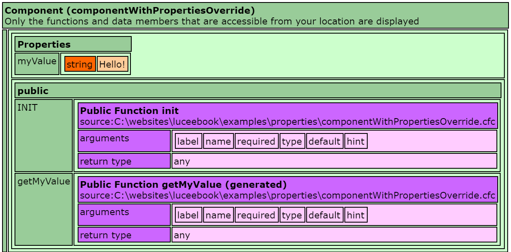
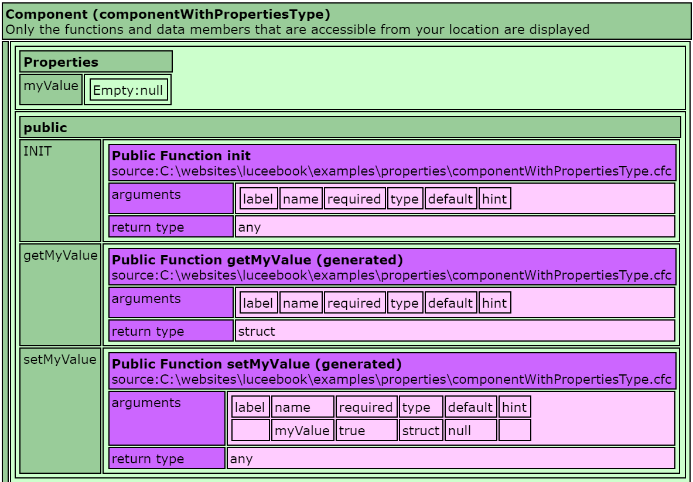

# Properties
Properties in Lucee allow annotating Components with meta data about fields in the component. Properties are most used when creating persistent Entities with the ORM, but they can also be used with POLO (Plain Old Lucee Objects).

- [Basic Example](#basic-example)
- [Lucee Generated Accessors](#lucee-generated-accessors)
  - [Overriding Getter & Setter](#overriding-getter--setter)
  - [Setting A Default Value](#setting-a-default-value)
  - [Constraining Type](#constraining-type)
  - [Populating Properties](#populating-properties)
  - [Validating Properties](#validating-properties)

##Basic Example
By default, properties do not change any behavior of the class and simply allow for meta data reflection. Consider this basic Component without any properties: 



<noscript>
```
component {
  
  public function init(){
  }
  
}
```
</noscript>

If we dump this component, it looks like:


And consider this component with a property:



<noscript>
```
component {
  
	property name='myValue';

	public function init(){
		return this;
	}
  
}
```
</noscript>

If we dump this component, it looks like the following:


You can see here that the components are nearly identical, the additional 'property' defined in the componentWithProperties.cfc did not change any behavior about the class. But if we look at the meta data using the reflection function `getComponentMetaData()`, our property appears under the 'properties' section:




Any attributes given to the property will appear in this meta data, and this functionality is often used by open source frameworks to dynamically read components and work with it. For example, the [Wirebox Dependency Injection](http://wiki.coldbox.org/wiki/WireBox.cfm) framework uses properties to determine how to configure components using the framework.

This meta data in of itself is not too interesting for most cases, but properties become more powerful with Lucee Generated Accessors.

Properties are also heavily used for the Lucee ORM. See the Lucee ORM documentation for details. The rest of this article will focus on the Generated Method functionality that Lucee provides.

##Lucee Generated Accessors
Lucee can use properties defined in a component to auto-generate getter and setter methods, set default values, and type check and validate the values. This is very handy for components with a lot of fields, as creating accessors to those fields is a lot of boilerplate code. 

Taking the componentWithProperties.cfc example above, all that is required to tell Lucee to use generated accessors is to add `accessors=true` to the component:



<noscript>
```
component accessors='true' {
  
	property name='myValue';

	public function init(){
		return this;
	}
  
}
```
</noscript>

Now when we dump this component, we see that it has a property:


And for comparison, here was the image of the componentWithProperties.cfc that did not have `accessors=true`


Notice two changes: 
- There is now a 'properties' data value in the component
- There are two new functions, `getMyValue` and `setMyValue`, Lucee created these automatically.

For each property, Lucee will generate a getter and a setter function.

With these functions generated, it is now possible to set and retrieve values into the component:



<noscript>
```
<cfscript>
myComponent = new componentWithPropertiesAccessor();
myComponent.setMyValue("Hello!");
echo(myComponent.getMyValue());
</cfscript>
```
</noscript>

This example above merely outputs `Hello!`

###Overriding Getter & Setter
If a particular property should not have a getter or a setter, tell Lucee to not generate it by setting `getter=false` or `setter=false` for that particular property. This is most often used to disable setters in which the value is handled by the internals of the component.

Consider the following component where we disable the setter and set the `myValue` variable within the constructor:



<noscript>
```
component accessors='true' {
  
	property name='myValue' setter='false';

	public function init(){
		variables.myValue = 'Hello!';
		return this;
	}
  
}
```
</noscript>

When we dump the component, it now looks like this, with the primary difference being that there is no `setMyValue` function, and we see that the property is populated with the value that was set in the constructor:



In this example below, it tries to use the `setMyValue()` function but it will throw an error (`component [componentWithPropertiesOverride] has no function with name [setMyValue]`), which is expected, because this function was not generated by Lucee.



<noscript>
```
<cfscript>
myComponent = new componentWithPropertiesOverride();
writeDump(myComponent);
echo(myComponent.getMyValue());
myComponent.setMyValue("Hello!"); //errors that function does not exist
</cfscript>
```
</noscript>

###Setting a Default Value
When using accessors, Lucee can also set the default value on component creation. Consider the following component with a default property:



<noscript>
```
component accessors='true' {
  
	property name='myValue' default='test this is a default!';

	public function init(){
		return this;
	}
  
}
```
</noscript>

When dumping this component it now looks like:


The difference here is the myValue property has a default without any code setting it in the constructor.

The following example shows using this default property value and will echo `test this is a default!`



<noscript>
```
<cfscript>
myComponent = new componentWithPropertiesDefault();
writeDump(myComponent);
echo(myComponent.getMyValue());
</cfscript>
```
</noscript>

Only simple values can be set in the default. Complex values should be set in the constructor of the component. 

###Constraining Type
The generated setter and getter can be type checked to a particular type so that Lucee throws an error if the caller trys to set the wrong type. Consider the following component: 



When dumping, notice the type annotations for the generated methods. The "Return Type" for getMyValue is now 'struct' and the arguments for setMyValue require a struct.



When trying to use the setter but passing the wrong type, it will throw an error like: `invalid call of the function setMyValue (componentWithPropertiesType.cfc), first Argument (myValue) is of invalid type, can't cast String [test] to a value of type [struct]`



Also be aware that providing a default value with a type will have no effect on the checking of the default value during creation. The type annotation only affects when calling the setter or getter.

###Populating Properties
For any of the Lucee generated setters, Lucee will also automatically call the setter for any key value pairs passed. Consider the following component: 



<noscript>
```
component accessors='true' {
  
	property name='myValue';
	  
}
```
</noscript>

> Note, we have not defined an init() constructor. Automatic property population only works without an init() constructor defined. If you define a custom init(), it will take precedence over Lucee calling the setters and the value will not be set.

This example below uses the above component but sets values on instantiation. Lucee will call the appropriate setter for each value:



<noscript>
```
<cfscript>
myComponent = new componentWithPropertiesNoConstructor(myValue:"Hello there!");
echo(myComponent.getMyValue());
myComponent = new componentWithPropertiesNoConstructor({myValue:"Hello there!"}); //Equivalent to the above
echo(myComponent.getMyValue());
myComponent = new componentWithPropertiesNoConstructor(argumentCollection={myValue:"Hello there!"}); //Equivalent to the above
echo(myComponent.getMyValue());
writeDump(now());
</cfscript>
```
</noscript>

####Constructor Valdiation
When using the population method above, it is not possible to define a constructor which validates object state, because defining such a constructor cancels the automatic populating. State either needs to be validated by defining customer setter methods for each property, or by manually calling a defined validation method after instantiation. 

There is an enhancement request for auto populating validation here: https://luceeserver.atlassian.net/browse/LDEV-815


###Validating Properties
Components with generated accessors (by defining `accessors=true`) can validate the data passed to the setter method automatically. This can quickly speed up adding complex type assertions to components without writing a lot of boilerplate code.

Adding validation to properties makes use of two attributes, `validate` for build in validation types, and optionally `validateparams` to additional custom validation types.

The validate attribute takes a type to be used for validating data when implicit setter for this property is called. It takes the following validators:

| Type | Description |
| -- | -- |
|string|Any string|
|boolean|Any boolean value, true or false|
|integer|any integer|
|numeric|any value which can be a number|
|date|any date|
|time|any time|
|creditcard| A 13-16 digit number conforming to the mod10 algorithm.|
|email| A valid e-mail address.|
|eurodate| A date-time value. Any date part must be in the format dd/mm/yy. The format can use /, -, or . characters as delimiters.|
|regex| Matches input against pattern specified in validateparams.|
|ssn| A U.S. social security number.|
|telephone| A standard U.S. telephone number.|
|UUID| A Home Universally Unique Identifier, formatted 'XXXXXXXX-XXXX-XXXX-XXXXXXXXXXXXXXX', where 'X' is a hexadecimal number.|
|guid| A Universally Unique Identifier of the form "XXXXXXXX-XXXX-XXXX-XXXX-XXXXXXXXXXXX" where 'X' is a hexadecimal number|
|zipcode| U.S., 5- or 9-digit format ZIP codes|

The validateparams attribute takes the parameters required by the validator specified in the validate attribute. This should be specified in the implicit struct notation.

| Parameter | Description |
| -- | -- |
|min| Minimum value if validate is integer/numeric/|
|max| Maximum value if the validate is integer/numeric/|
|minLength| Minimum length of the string if the validate is string|
|maxLength| Maximum length of the string if the validate is string|
|pattern| regex expression if the validator specified in validate attribute is regex

The following example validates an email address with one of the above types and a custom string validation with validateparams:



Here is an example of using the above component: 




