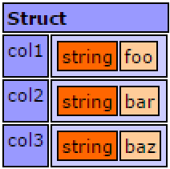

# Queries

This article deals with working with existing query objects (recordsets). To see how to make SQL statments in Lucee, see the article on [SQL Persistence](https://rorylaitila.gitbooks.io/lucee/content/sqlrdbms.html)

Query objects in Lucee are a powerful type of variable that acts a bit line an array, and a bit like a structure. It is the data type that Lucee returns SQL record sets into, and is also useful as a data structure for non SQL operations. Lucee Query objects are created from SQL statements, the ORM, Other Query objects, Directory functions, HTTP requests, and more. 

Query objects conceptually look and act like a database table, like a spreadsheet. They have columns and rows.

In these examples, they will use a Query object created manually.

##Creating a Query Object


##Adding new Rows
New rows can be appended onto the ends of query objects. The addRow() function takes data, as in this example, or it can be empty in which case it appends an empty row.



>myquery dump
>

This dump above shows a new row being added to the previously empty query

##Adding New Columns
With any existing query object, new columns can be added and populated with data:



> myQuery Dump
> 
> 

In this dump we see that an additional column was added, but it also filled in the rows of previous columns which did not have any data. All of the query functions keep all of the columns & rows in sync.

##Retreiving Query data by Column

To get all of the data from a particular column out of a query, use the `columnData()` function



>Dump of columnData()
>
>