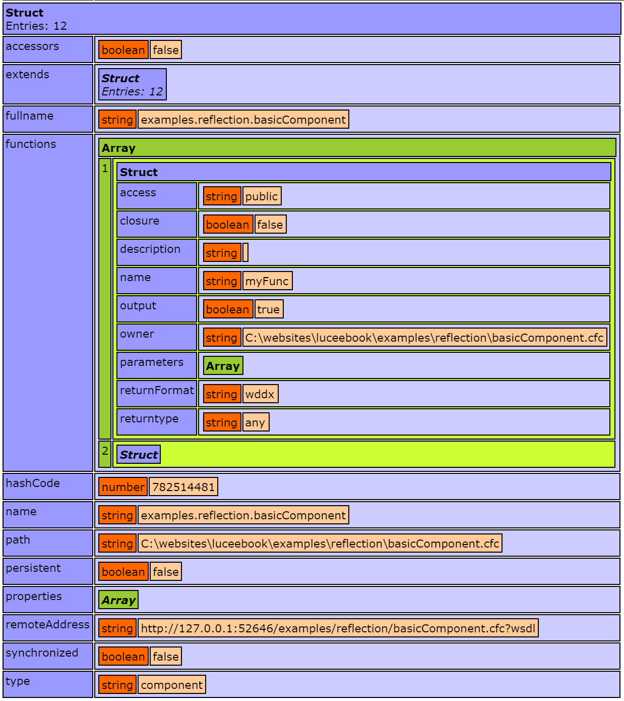

# Reflection

With Lucee, components and Java classes can be introspected at runtime to obtain meta data about them such as their name, what functions they implement, and the properties that they have; among other data. Reflection, combined with Lucee's meta programming and mixin capability, can provide powerful runtime solutions for certain scenarios.

Use of Reflection in Lucee and modifying classes at runtime is an advanced feature and should be used only for advanced situations, as runtime modifications are not easy to track down, and can bypass much of the type system. 

##Reflecting/Introspecting Lucee Components
Introspecting Lucee components is accomplished with two functions in the standard library, `getMetaData()` and `getComponentMetaData()`. Both of these functions return the same data, but getMetaData operates on an instantiated class, and getComponentMetaData operates on a source file. 

Take for example the following component:



To reflect this component, instantiate it and use the getMetaData() function on it:



This example above dumps the result of the metaData variable, which looks like this

>note: For conciseness, some of the data elements dumped have been hidden

Use of `getMetaData()` requires an instantiated component, which is useful when wanting to introspect a component at runtime. However it is also possible to introspect the source file of a component:



This will produce the same dump output as in the preceeding example.

The reason one may use getMetaData() rather than getComponentMetaData() is when they do not know the source file of the Component being inspected, but simply have a reference to an already existing Component. 